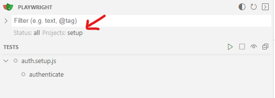
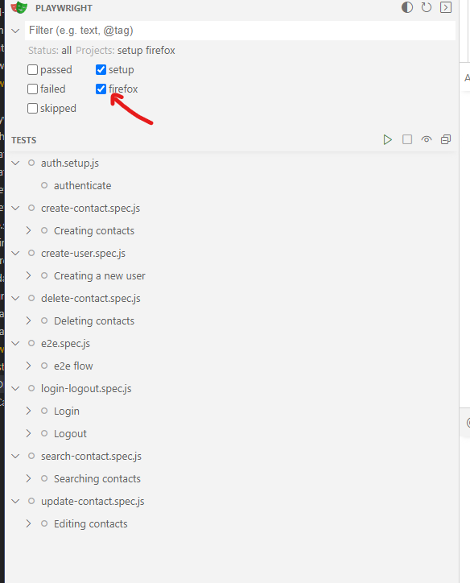

# Jentis task
**Please check the Questions.md document to find the answer to the questions of the case study.**

**The test cases documentation can be found in the TestCases.txt**

----

**Please follow the next steps to correctly execute the test cases:**

1) Install dependencies: `npm i`
2) Install browsers: `playwright install`
3) Execute all the tests that are marked with the @task tag: `playwright test --grep "@task" --workers=1`
4) Check report with: `npx allure serve allure-results`

Beside the tests marked with the @task tag there are more test cases that can be executed either from UI or directly by API calls, to check all the test cases please use the following command: `npx playwright test --ui`

Some considerations when using the visual interface of Playwright:

1) The first time you might see only the auth.setup test available, if that's the case execute it and it will authenticate and save the cookies so you don't need to do it in subsequent tests
2) If you still see only this test, please check the settings and be sure to select firefox as well:

3) Instead of executing all tests at once by clicking the green arrow at the top of the tests, please execute one by one to avoid race conditions.